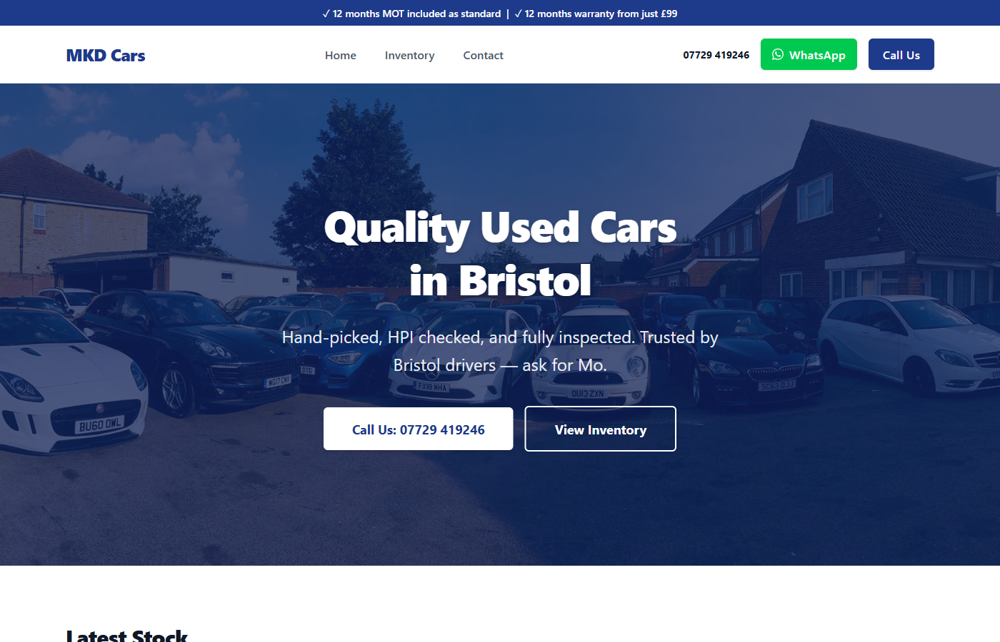

# MKD Cars Website

A fast, SEO-focused used-car dealership website for MKD Cars in Bristol.

Live demo: [mkd-car-website.vercel.app](https://mkd-car-website.vercel.app)



## What It Includes

- Trust-focused homepage for a single-location used car dealer
- Inventory listing page with vehicle cards and filters
- Vehicle detail pages generated from structured inventory data
- Responsive vehicle image galleries
- Finance calculator component
- Contact page with phone, WhatsApp, directions, opening hours, and embedded map
- SEO metadata, canonical routes, Open Graph data, and vehicle structured data
- Real vehicle imagery stored in `public/images`

## Why This Project Exists

The goal was to turn a small dealership's stock and trust signals into a clean, fast website that helps buyers answer the practical questions quickly:

- What cars are available?
- What does each vehicle cost?
- What is the mileage, fuel type, transmission, MOT, warranty, and service history?
- How do I call, WhatsApp, get directions, or book a test drive?

This is a client-style portfolio project: the value is in the complete business surface rather than a novel technical trick.

## Tech Stack

- Next.js App Router
- React
- TypeScript
- Tailwind CSS
- Sync-ready inventory provider in `app/data/stock.ts`
- Static fallback inventory data in `app/data/vehicles.ts`
- Generated static vehicle detail pages

## Auto Trader Stock Sync

The site is now prepared for an Auto Trader-first stock workflow:

1. MKD updates cars in Auto Trader.
2. The website reads the Auto Trader stock feed/server API.
3. Auto Trader webhook notifications can clear the Vercel cache so changes appear without a new deploy.

Until Auto Trader Connect credentials are available, the website safely falls back to the existing stock file in `app/data/vehicles.ts`.

Required Vercel environment variables:

```bash
AUTOTRADER_ENABLED=true
AUTOTRADER_STOCK_FEED_URL=https://...
AUTOTRADER_API_TOKEN=...
AUTOTRADER_API_KEY=...
AUTOTRADER_WEBHOOK_SECRET=...
```

`AUTOTRADER_API_KEY` is optional if the approved Auto Trader endpoint only needs a bearer token. The exact `AUTOTRADER_STOCK_FEED_URL` and authentication values come from Auto Trader Connect during onboarding.

Webhook endpoint for Auto Trader/Vercel cache refresh:

```text
POST /api/autotrader/revalidate
```

Send the webhook secret as either `Authorization: Bearer <secret>`, `x-webhook-secret`, `x-autotrader-webhook-secret`, or `?secret=<secret>`.

## Running Locally

Install dependencies:

```bash
npm install
```

Run the development server:

```bash
npm run dev
```

Open `http://localhost:3000`.

Create a production build:

```bash
npm run build
```

Run linting:

```bash
npm run lint
```

## Project Shape

- `app/page.tsx` - homepage and featured vehicles
- `app/inventory/page.tsx` - full vehicle inventory
- `app/inventory/[id]/page.tsx` - generated vehicle detail pages
- `app/contact/page.tsx` - contact and location page
- `app/data/stock.ts` - Auto Trader stock provider with static fallback
- `app/data/vehicles.ts` - structured stock data
- `app/api/autotrader/revalidate/route.ts` - webhook endpoint to refresh cached stock
- `components/` - header, footer, vehicle cards, gallery, filters, and finance calculator
- `public/images/` - vehicle photography

## Status

Portfolio-ready dealership website. The live demo is available, the production build passes, and lint runs with only image-optimization warnings from raw `` usage in vehicle gallery/card components.
